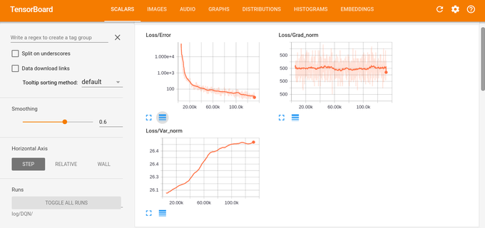

# TensorPoker
Neural networks based, poker bots.

This project consists of three main parts:
1. DQN based poker bot
2. A3C based poker bot
3. Cards embedding

### DQN based poker bot
The most detailed solution - modular, customizable, commented and tested.

### A3C based poker bot
Solution placed in one jupyter notebook (todo: make it modular). It more powerful and efficiency.
It uses threading. Need more tests. 

### Cards embedding
Embedding for cards in a hand. Conv net was used. Training by predicting win rate from cards.

All parts use TensorFlow and TensorBoard, witch visualize losses, performance and validation metrics.
For example visualization of loss for DQN:

Tested in PyPokerEngine (Texas Holdem, no limit).